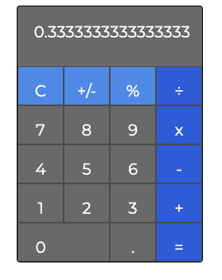
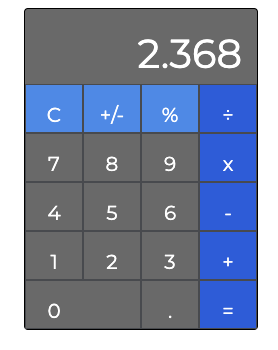

# Apple Calculator Clone
 
Apple Calculator Clone is my attempt at creating the Apple Calculator all in vanilla JS. One day when the power was out (no internet) I challenged myself to create a basic calculator. I used the Apple calculator as an example to follow along with. What I'm most proud of is that I tried this challenge a year ago and struggled just to render the buttons.
 
## Screen Shots
 

 
 
## Running / Setup Instructions
 
### Github Pages
 
Head over to http://www.johnreiner.me/calc/ to use the calculator!
 
## Background Information
 
This was a personal challenge I set for myself. The project took a bit over 3 hours to create. I used an array to set the buttons a value and mapped over the array to render the buttons and assign a value. Each time you click on a button the event listener determines if or what type of calculation should be performed.
 
In the future I would love to condense my code. The code is not perfect right now and was just used to get the calculator working.
 
### Technologies Used
 
 - Javascript
 - CSS
 - HTML
